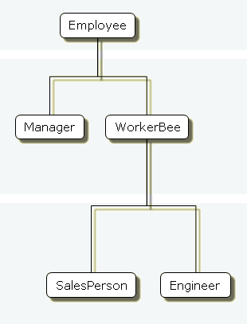

# 2017-08-26
JS는 클래스 기반이 아닌 prototype에 기초한객체 기반 언어다. 
## 클래스 기반 언어 vs 프로토타입 기반 언어
Java와 C++같은 클래스 기반의 언어들은 두 개의 구별되는 개념에 기반을 두고 있다.
<ul>
    <li>클래스는 특정 객체군을 특징 짓는 모든 속성들을 정의한다.</li>
    <li>반면 인스턴스는 클래스를 기반으로 실체화 된 것 이다.</li>
</ul>
JS같은 prototype기반의 언어들은 위와 같은 클래스와 인스턴스의 차이를 두지 않는다. 
간단하게 객체들을가질 뿐이다. 
prototype기반의 언어는 원형의 객체 개념을 가지고 있다. 하나의 객체는 새로운 객체를 생성했을 때 초기 속성을 가질 수 있도록 하는 형판으로 사용된다. 
객체는 생성될 때 혹은 실행 시에 자기 자신의 속성을 명시할 수 있다. 
추가적으로, 객체들은 또 다른 객체를 생성하기 위한 프로토타입이 될 수 있고, 프로토타입으로부터 생성된 두 번째 객체가 프로토타입인 첫 번째 객체의 속성을 공유하는 것을 허용한다. 

### 클래스 정의
클래스 기반의 언어에서, 별도의 클래스를 생성하고 그 안에서 해당 클래스를 정의한다. 
해당 클래스에서 인스턴스를 생성하기 위해서는 new 연산자와 함께 생성자를 호출해야 한다. 

JS는 비슷한 방법을 사용한다. 하지만 생성자 이외에 따로 클래스 정의를 가지고 있지 않다. 
대신, 특정 속성 및 속상값들을 가지고 객체를 생성하는 생성자 함수를 정의할 수 있다. 
새로운 객체를 생성하려면 new 연산자를 사용한다. 
### 하위 클래스와 상속
클래스 기반의 언어에서 클래스 정의를 통해클래스들의 계층 구조를 생성할 수 있다. 
JS는 프로토탕비 객체와 생성자 함수를 결합하도록 허용함으로써 상속을 구현한다. 
### 차이점

# 귀찮으니 예제만 만들어봤다. [js](1.js)
# 계층 구조 