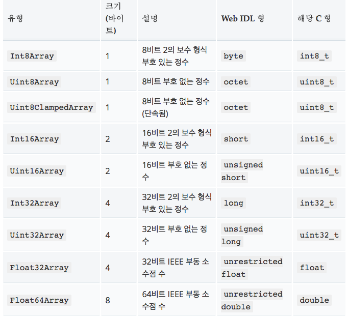

# 2017-09-11
JS의 Array는 배열같은 객체고, 형식화 배열은 원시 이진데이터를 접근하기 위한 매커니즘을 제공한다. 
Array와 형식화 배열은 다르다. 
## 버퍼 및 뷰: 형식화 배열 구조
구현은 버퍼와 뷰로 나눠진다. 
ArrayBuffer로 chunk를 나타내고, 
밑에 이미지로 접근 가능함.
## 사용해보기
[js](1.js)
## 같은 데이터 여러 뷰
[js](2.js)
## 복잡한 데이터 구조화
[js](3.js)
## 일반 배열로 변환
[js](4.js)